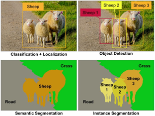
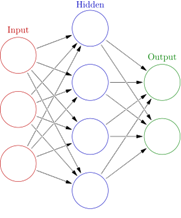
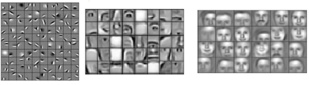

# Convolutional neural network

Researchers designed convolutional neural networks (CNNs) because they needed better tools to process images. Most systems that “see” the world – self-driving cars, medical diagnostics, etc. – use a convolutional neural network. Let’s break down the key concepts.

Neural networks are a class of algorithms that are used in many machine learning problems. The basic building block is a neuron, which performs a simple operation on its input. These neurons are arranged into layers, which are connected into a network that can perform complex tasks. Engineers have considerable flexibility when structuring layers and connections, making these algorithms suitable for many problems.

Convolution is a special type of operation that answers the question, “How much of B is in A?”, where A is often an image, and B is often a pattern. For instance, if A is an image of a house, and B is a horizontal edge, the convolution might return the following image:

By connecting many such operations into a neural network, CNNs are able to detect increasingly complex features. For example, in a CNN for face detection, early layers look for edges, intermediate layers look for facial components, and later layers look for full faces.

Ultimately, CNNs are useful for tasks like classification, detection, and segmentation.

