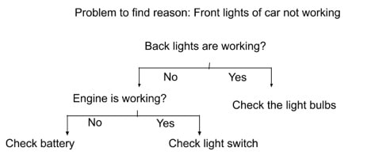

# Expert systems

Think about the way a doctor knows what is wrong with a patient: he starts asking questions and  based on the answers he deduces what is most probably the problem. For instance, you might seek his advice about a headache. He might ask: is it in the back of your head? If you say yes, he would think it could be due to elevated blood pressure, and continue asking you about other relevant symptoms, if you say no, he will ask you is it in your forehead? And so on until he has a probable diagnosis.

The process of building a set of questions that if you follow their answers you will reach the information you are looking for is called an Expert System.  They might look like this:

