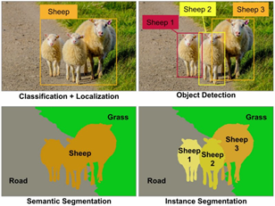

# Convolutional neural networks

Researchers designed convolutional neural networks (CNNs) because they needed better tools to process images. Most systems that “see” the world – self-driving cars, medical diagnostics, etc. – use a convolutional neural network.

CNNs are useful for tasks like classification, detection, and segmentation.

## Neural networks

Neural networks are a class of algorithms that are used in many machine learning problems. Their basic building block is a *neuron*, which performs a simple operation on its input. These neurons are arranged into *layers*, which are connected into a network that can perform complex tasks. Engineers have flexibility when structuring layers and connections, making these algorithms suitable for many problems.

## Convolutional neural networks

*Convolution* is a special type of operation that answers the question, “How much of B is in A?” In image recognition networks, for example, A is often an image, and B is often a pattern; so a CNN asks: how much of this pattern is in this image? For instance, if A is an image of a house, and B is a horizontal edge, the convolution might return the following image:

By connecting many such operations into a neural network, CNNs are able to detect increasingly complex features. For example, in a CNN for face detection, early layers look for edges, intermediate layers look for facial components, and later layers look for full faces.

