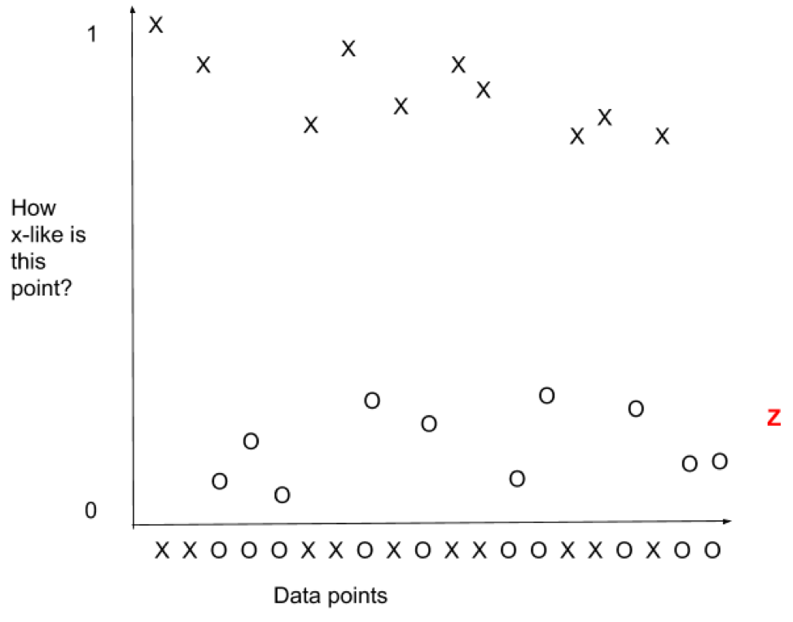
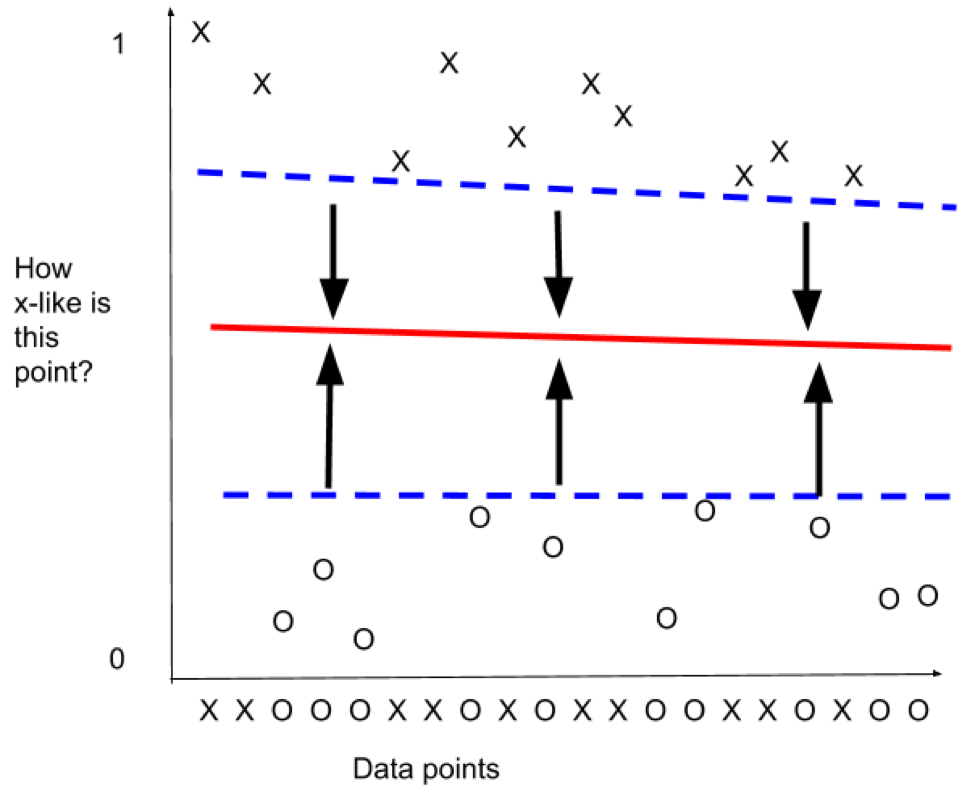

## Kernels and Support Vector Machines

Kernels and Support Vector Machines are a classification technique used in Supervised Learning. 

As a Supervised Learning method, it means that the model must be trained on labeled data; that is, the training data has to consist of a fairly large dataset in which each data point has a “label” with the correct class

# How it works:

Say you have a dataset of points of “X” class and “O” class, that looks like this

	XXOOOXXOXOXXOOXXOXOO

This is the data shown in a single dimension (a line), and in this many dimensions, you wouldn’t be able to draw a line between the different classes, or divide them in any way. This kind of division is very important for the ability to correctly classify a new data point

So for example, if we gave you another data point, like this: 
XXOOOXXOXOXXOOXXOXOOZ

How would you classify the “Z”? It’s entirely unclear whether the “Z” should be classed as an X or a O

So one of the things you can do is compare the datapoints to each other. So take the initial X of the set, and compare all the others to it - How X-like are each of the other points? Once you have a mathematical comparison number between 0 and 1 (0 means the points are nothing alike, 1 means they’re identical), you can graph it like this:

 

Once we’ve graphed the similarity,  it’s easy to see that the other points in the “X” class are similar to the first “X” and the points in the “O” class are dissimilar to the first “X”

Now, when we look again at our “Z”, it’s easy to see…

 

That “Z” belongs to the “O” class.

But what if “Z” is not clearly in one class or the other - where do we draw the line between the two? 

We want the line between the two classes to be as “in between” the classes as possible, so we do something like this: 

 

The red line is at the furthest distance from both dashed blue lines, so the red line is the best line to divide the two classes.

Keep in mind that for this explanation, we’ve been talking about just two classes and two dimensions, and many (if not most) machine learning systems would be doing this with multiple classes and many, many more dimensions than two. 

This is a powerful technique that works well in many instances - but it can also be too powerful, in that with enough dimensions, you can separate ANY points from any other points. This means that with Kernels and SVM you can end up with divisions within the data that don’t mean anything. This can compromise the performance of the model if the developer hasn’t tested it adequately.

SVM is also not a very explainable technique, so for instances in which you need a clear explanation of how the classification was arrived at, SVMs aren’t your best bet.

The kernel trick and SVMs are used in quite a few business applications.

For handwriting recognition software, each handwritten character is classified as a letter of the alphabet, in order to turn it to digital text. 

Image classification in general commonly use SVM. Medical images, for example, like cancer classification or protein classification in bioinformatics.

Service providers commonly use SVM for multi-tenant arrangements, to isolate each tenant’s data to accurately charge individual tenants for services used.

Text classification, such as sentiment analysis is also a common way to use SVMs
