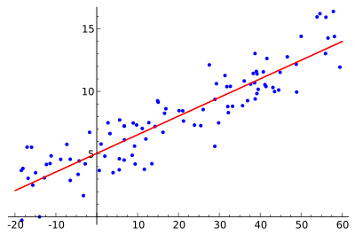
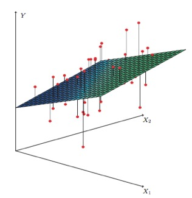

# Linear Regression
 
***What is it?***

Linear Regression is a statistical method to model the relationship between one output (or dependent) variable (Y) based on one or more input (or independent) variables (Xs). Input variables (Xs) are also called explanatory variables as they explain the output variable (Y). 
                                                  
 

***When to use it?***

It should be used when you can expect (or hypothesize) a linear relationship between the predicted output variable (Y), and the independent input variables (Xs). Further, it can only be used when you are trying to predict a numerical value for the output variable (Y). 
 
***How does it work?***

The model works by fitting a line (when there is one input variable) or a linear plane (when there are two or more input variables). This fit is determined by minimizing the distance between the predicted line (or hyperplane) and the given data points. 
 
***What are some of the business use cases for regression?***

- Prediction of future copper prices based on given input variables such as past prices, and economic indicators.
- Prediction of future sales based on spending in various advertising mediums.
- Association - How the impact on sales may change, if instead of investing $100k in TV advertising, $50K is invested in TV advertising, and $50K is invested in Digital Media simultaneously?
- If-then analysis – If a specific investment is made in additional doctors, then, how much decrease in patient wait time can be achieved?
- Understand the top five factors that that can cause a customer to default on their loan payment. 
- How does customer churn relate to our competitor's product release?
